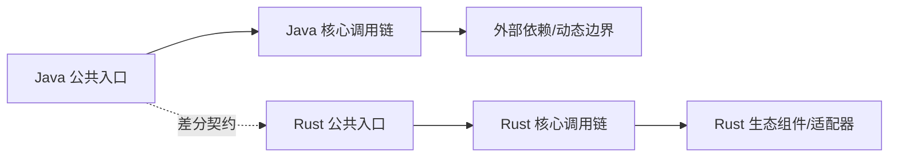

# {{MODULE_NAME}} Java → Rust 全量迁移路线图

> 生成日期：{{GENERATED_DATE}}
> Java 基线：`{{JAVA_BASELINE}}`
> Rust 基线：`{{RUST_BASELINE}}`
> 最近按 Rust 基线审计：{{AUDITED_DATE}}
> 文档状态：`{{DOCUMENT_STATUS}}`
> Java 模块：`{{JAVA_ROOT}}`
> Java 包根：`{{JAVA_PACKAGE_ROOT}}`
> Rust 目标：`{{RUST_ROOT}}`
> 维护规则：本文档必须与对象表、语义表、名称检查及代码在同一变更中更新。

<!-- current-migration-contract-start -->
## 当前迁移规范执行口径

- 本文是当前权威路线图，必须以对象台账的当前事实为输入；模板生成仅代表 `DRAFT`。
- 路径算法为从 `{{JAVA_PACKAGE_ROOT}}` 起保留末 `{{RETAIN_SEGMENTS}}` 层包目录；优先修复 `MISPLACED`，再处理 `MISSING`、`STUB`/`PARTIAL` 和 `UNVERIFIED`。
- 依赖复用不改变 Spring/Java 的结构主线；只有精确符号、版本/提交、本地适配器和集成测试齐全时才能标 `DEPENDENCY_REUSED`。
- 测试通过、覆盖率或编译成功不能覆盖未完成对象；存在任一严格阻断状态时，不得宣称模块完成。
- 旧版路线图的有效设计内容合并到本文历史附录，当前源码和工作树重算的计划在前。
<!-- current-migration-contract-end -->

## 一、迁移目标与边界

### 总目标

<!-- TODO：说明公共 API、行为、示例、文档、测试和生产替代目标。 -->

### 纳入范围

| 范围 | Java 入口 | Rust 目标 | 完成标准 |
|---|---|---|---|
| 生产对象 | <!-- TODO --> | <!-- TODO --> | 对象、方法、参数、逻辑可追溯 |
| 示例/脚本 | <!-- TODO --> | <!-- TODO --> | 真实回放通过 |
| 测试/夹具 | <!-- TODO --> | <!-- TODO --> | 源测试/具体 case 100% 无损实现，测试资产 SHA-256 原样复制，完整差分全 MATCH；Rust 原生测试增量补充 |
| 整体验收模块 | 源 system/templatesuite/test-utils | `<project>-test`（`publish = false`） | 统一执行跨 crate、绑定/适配器、完整回放与差分；局部测试不得替代 |
| 宿主集成 | <!-- TODO --> | <!-- TODO --> | 真实依赖集成通过 |

### Rust crate 边界与 workspace 拓扑

| Java 模块/职责 | Rust crate | 独立边界依据 | member 路径 | 发布/测试生命周期 |
|---|---|---|---|---|
| <!-- TODO --> | <!-- TODO --> | publish/dependency/feature/target/proc-macro/FFI/test | <!-- TODO --> | <!-- TODO --> |

| 候选拓扑 | 项目证据 | 结论 |
|---|---|---|
| 根目录扁平 / 领域混合分组 / `crates/` 收纳分组 | crate 数、稳定家族、根目录噪声、多语言、现有路径兼容性 | <!-- 采用/拒绝及理由；数量仅是复审信号 --> |

> 不得按 Maven/Gradle module 一对一生成 crate。先确定 Rust crate 边界，再为小型 workspace 选择根目录扁平、为成长型项目选择混合分组、为大型或多语言仓库选择收纳分组。`<project>-test` 的父目录服从本决策。

### 明确排除与受阻项

| 范围 | 状态 | 原因/依赖 | 是否暴露 | 覆盖率口径 | 退出条件 |
|---|---|---|---|---|---|
| <!-- TODO --> | `MISSING` / `STUB` / `PLATFORM_NA` | <!-- TODO；阻塞原因作为元数据，不改变事实状态 --> | <!-- TODO --> | 未完成状态不计入；平台不适用单列 | <!-- TODO --> |

## 二、基线盘点

| 维度 | Java 当前值 | Rust 当前值 | 目标 | 证据命令/文件 |
|---|---:|---:|---:|---|
| 模块/crate | <!-- TODO --> | <!-- TODO --> | <!-- TODO --> | <!-- TODO --> |
| 对象/主文件 | <!-- TODO --> | <!-- TODO --> | <!-- TODO --> | <!-- TODO --> |
| 公共方法/构造器 | <!-- TODO --> | <!-- TODO --> | <!-- TODO --> | <!-- TODO --> |
| 示例/脚本 | <!-- TODO --> | <!-- TODO --> | <!-- TODO --> | <!-- TODO --> |
| 测试 | <!-- TODO --> | <!-- TODO --> | <!-- TODO --> | <!-- TODO --> |

> 每个统计值必须附可重放命令或机器可读清单。旧 SHA 的统计不得用于当前完成率。

## 三、设计原则

1. 功能语义与可观察行为对齐，实现方式 Rust 化。
2. 每个 Java 类、接口、枚举或 record 对应一个主要 `.rs` 文件。
3. 目录、文件、方法、参数使用 `snake_case`，类型使用 `PascalCase`。
4. `lib.rs`、`mod.rs` 只声明和重导出，不集中定义迁移对象。
5. 所有已有 Java 对象、构造器、方法、泛型/值参数、返回、异常、元数据标签和关键逻辑注释均迁移为可追溯的中文 Rust 文档。
6. 不删减已经可用的 Rust 实现；以增量补齐和兼容包装继续迁移。
7. 编译、登记、文件存在不等于行为完成。
8. 组件选型按语义合同、硬约束、风险 POC、共享合同测试和真实宿主证据晋级，不按 Java/Rust 框架名称机械替换。
9. Rust 对外 API 使用惯用命名；JavaBean、脚本属性或反射兼容由显式 registry/member resolver 适配，不机械生成 `get_*`。
10. `ADAPTED` 只表示映射方式，必须另行填写 `MISSING`、`UNVERIFIED`、`IMPLEMENTED` 等事实状态。
11. 迁移后的公开 API 遵守本地 `rust-api-design`：`get_*` 仅用于 lookup，转换按 `as_`/`to_`/`into_` 与 `From`/`TryFrom` 语义命名，禁止用 `Deref` 伪造继承。
12. 默认以完整 Java 源模块为一次迁移批次；实现阶段按依赖顺序连续完成全部语义迁移。
13. 禁止“迁移一个对象 → 比对一个对象 → 测试一个对象”的循环；全部实现冻结后再统一静态审计与验证。
14. 对象级行用于全量追踪和最终覆盖率核算，不作为实施中的验收检查点。
15. Java 源码决定对象分母及目标 crate 内的确定性 `src/` 路径；Rust 发布、依赖、feature、target、宏/FFI 和生命周期决定 crate 边界，项目规模与家族决定 workspace 成员目录。
16. `DEPENDENCY_REUSED` 必须精确到 crate、版本/提交、上游源码符号、本地调用点和集成测试。
17. 仅 JVM、字节码、类加载器等不可迁移能力可标 `PLATFORM_NA`。
18. `.rs` 文件 ≤500 行为正常、501–800 行需职责审查、>800 行阻断；函数/方法超过 Clippy 100 行信号需审查，拆分不得混入第二个 Java 对象。
19. 聚焦私有行为的 Rust 单元测试可内联；集成、差分、宿主、负载和整体验收测试放入 `tests/` 或测试包。
20. 仓库/产品级迁移必须建立非发布的 `<project>-test` workspace package，集中拥有整体功能验收；多 crate、binding/adapter 或源 system suite 尤其不得省略。

## 四、依赖与调用链



| 调用链 | Java 语义 | Rust 设计 | 动态边界 | 验证 |
|---|---|---|---|---|
| <!-- TODO --> | <!-- TODO --> | <!-- TODO --> | <!-- TODO --> | <!-- TODO --> |

### 组件替换决策

| Java 职责 | 必须保持的合同 | 搜索词/来源/观察日期 | Rust 形态/候选 | 硬门禁 | 适配度/生态健康/置信度 | 依赖归属 | 采用状态 | 风险 POC/下一门禁 |
|---|---|---|---|---|---|---|---|---|
| <!-- TODO --> | API/数据/错误/生命周期/并发/安全/运维 | <!-- 至少记录能力/协议/约束搜索词与主来源 --> | std/direct/wrapper/trait+adapters/SPI/macro/redesign/host/exempt | contract/license/MSRV/target/runtime/security/maintenance | <!-- 分项证据；未知项不可乐观计分 --> | <!-- TODO --> | `CANDIDATE` / `DEPENDENCY_DECLARED` / `SPIKE_VERIFIED` / `CONTRACT_VERIFIED` / `HOST_VERIFIED` / `PRODUCTION_READY` | <!-- TODO --> |

## 五、阶段总览

| 阶段 | 内容 | 状态 | 交付物 | 阶段出口 |
|---|---|---|---|---|
| B0 | 冻结全量基线、四文档和批次清单 | <!-- TODO --> | SHA、工具链、对象/签名/测试/例外完整分母 | 范围、合同、依赖顺序和口径锁定 |
| B1 | 锁定架构与组件替换 | <!-- TODO --> | 共享错误、trait、registry、adapter、并发与依赖决策 | 阻断性决策已解决或获批 |
| B2 | 一次性完成整批语义实现 | <!-- TODO --> | 全部对象、方法、重载、注释、示例、测试代码 | 所有非豁免行有真实实现；尚未运行验收 |
| V0 | 实现冻结与统一静态审计 | <!-- TODO --> | 全量 CodeGraph/静态差分、四文档批量回填 | 完整分母无遗漏、无 STUB |
| V1 | 统一工程验证 | <!-- TODO --> | fmt/check/test/doc/Clippy/feature/target 结果 | 整批工程门禁通过 |
| V2 | 统一行为验证 | <!-- TODO --> | `<project>-test` 执行完整镜像、golden/live 差分、真实脚本回放 | 全部源 case MATCH，无 skip/not-run |
| V3 | 统一非功能验证 | <!-- TODO --> | 并发、负载、soak、property/fuzz、安全报告 | 阈值通过 |
| V4 | 宿主、灰度与回滚 | <!-- TODO --> | 真实集成、灰度和回滚记录 | 生产替代门禁通过 |

## 六、阶段任务

### 当前批次：<!-- TODO：必须是完整模块或用户明确授权的多模块范围 -->

| Java 对象/能力 | Rust 文件/能力 | 前置依赖 | 工作项 | 末端验收归属 | 状态 |
|---|---|---|---|---|---|
| <!-- TODO --> | <!-- TODO --> | <!-- TODO --> | <!-- TODO --> | <!-- TODO --> | `MISPLACED` / `MISSING` / `STUB` / `PARTIAL` / `UNVERIFIED` |

> B2 实现期间不得逐行执行测试或升级为“已验收”。全部实现冻结后，在 V0
> 一次性完成静态对照并批量回填状态，再进入 V1–V4。

## 七、工程与质量门禁

以下命令只能在 B2 整批实现完成并冻结后统一执行，不得作为逐对象检查点：

```bash
cargo fmt --all --check
cargo check --workspace --all-targets --all-features
cargo test --workspace --all-targets --all-features
cargo clippy --workspace --all-targets --all-features -- -D warnings
```

补充门禁：

- 对象、方法、重载、参数差分；
- `SOURCE_PARITY/TEST_CASE`：每个 Java 测试和具体参数化/动态用例均无损实现，输入、断言、错误、状态、副作用和清理均保真；
- `SOURCE_PARITY/TEST_ASSET`：每个 fixture/resource/script/corpus/golden/data 文件均原样复制并校验 SHA-256；
- Java suite、Rust suite 和完整 golden/live differential 全部通过，每个 case 为 `MATCH`，无 mismatch、harness failure 或 not-run；
- `RUST_OBLIGATION`：所有权/Drop、async 取消、错误、serde、feature、宏、unsafe、组件和 adapter 等目标机制义务；
- `VALUE_ADD`：由分支、mutant、property、fuzz、事故、负载或安全风险驱动的增量测试；
- 组件替换的 manifest、POC、共享合同、真实宿主和生产状态分别记录；
- 真实脚本、并发、负载、fuzz、宿主、回滚证据；
- `lib.rs` / `mod.rs` / `compat.rs` 集中定义、通配导入和空实现检查。
- `.rs` 文件 500/800 行分级、Clippy 100 行函数信号、职责拆分和 Rust 惯用测试组织检查。

## 八、风险与对策

| 风险 | 影响 | 触发信号 | 对策 | Owner |
|---|---|---|---|---|
| <!-- TODO --> | <!-- TODO --> | <!-- TODO --> | <!-- TODO --> | <!-- TODO --> |

## 九、完成定义

- [ ] 四文档与代码同步。
- [ ] 四文档使用相同 Java/Rust 基线，并记录最近审计日期；所有完成状态有当前 SHA 的证据锚点。
- [ ] 全量清单、语义合同和组件决策在编码前冻结。
- [ ] source-module-to-crate 映射与 workspace 拓扑已按目标项目证据记录，实际 member 路径一致。
- [ ] 所有非豁免对象先在 B2 一次性完成真实实现，期间未逐对象比对、测试或验收。
- [ ] V0 使用完整冻结分母完成一次统一静态审计，V1–V4 统一执行适用验证。
- [ ] 每个 Java 对象、方法、重载、参数都有明确去向。
- [ ] Java Getter/Setter 已映射为 Rust 惯用 API；需要兼容的字段、脚本或动态访问已标记 `ADAPTED` 并有双层测试。
- [ ] 每个 `.rs` 文件不超过 800 个物理行；501–800 行文件和超过 Clippy 100 行信号的函数已有职责审查，拆分文件只服务同一对象。
- [ ] 聚焦单元测试可位于 `#[cfg(test)]`；集成、差分、宿主、负载和整体验收测试位于 `tests/` 或测试包。
- [ ] Java 对象/方法 JavaDoc、所有 `@param`、`@return`、`@throws`、元数据标签及关键行内注释均有 Rust 对应和来源锚点。
- [ ] `MISSING`、`MISPLACED`、`STUB`、`PARTIAL`、`UNVERIFIED` 均未计入已处理；阻塞原因只作为元数据。
- [ ] `DEPENDENCY_REUSED` 和 `PLATFORM_NA` 均有严格证据，未用相似能力模糊豁免。
- [ ] 高价值调用链完成语义迁移与差分验证。
- [ ] 每个第三方组件有合同、搜索词与观察日期、硬约束、同类候选相对评估、归属 crate、证据状态、淘汰理由、替代方案和退出策略。
- [ ] 镜像测试没有被标成 golden/live 差分。
- [ ] 每个 Java 测试和具体 case 均已 100% 无损迁移；每个测试资产均已原样复制且 SHA-256 一致。
- [ ] 完整 Java/Rust 测试和逐 case 差分均通过，仅有 `MATCH`，无 harness failure 或 not-run。
- [ ] 需要整体验收模块时，`<project>-test` 已按所选拓扑加入 workspace、`publish = false`，并由 CI 显式执行；生产 crate 和 binding 内测试仅承担局部职责。
- [ ] Rust 特有义务已审计，增量测试能说明可捕获的缺陷，且未用于替代任何源测试。
- [ ] 真实脚本、并发、负载、安全、宿主和回滚门禁有证据或明确缺口。
- [ ] 最终报告分别给出结构、实现、行为、集成和生产就绪度。

<!-- historical-design-appendix-start -->
## 历史设计附录

<!-- 合并旧路线图仍有效的决策背景；历史里程碑、旧统计和旧完成状态不得覆盖当前路线图。 -->
